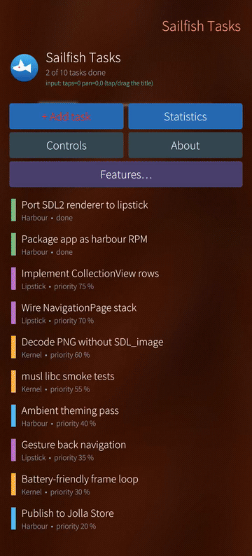
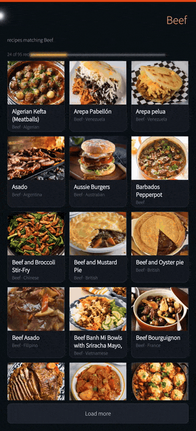
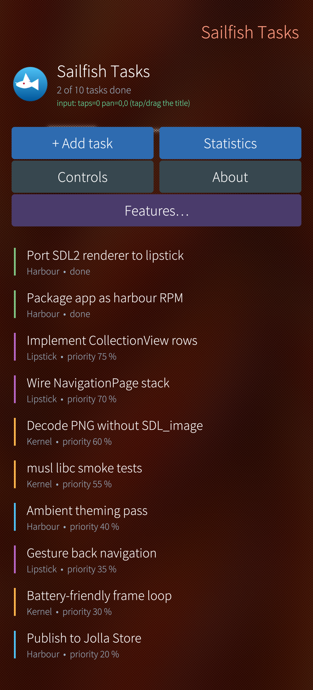
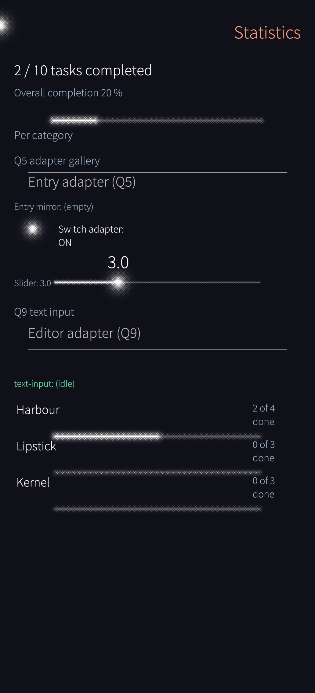
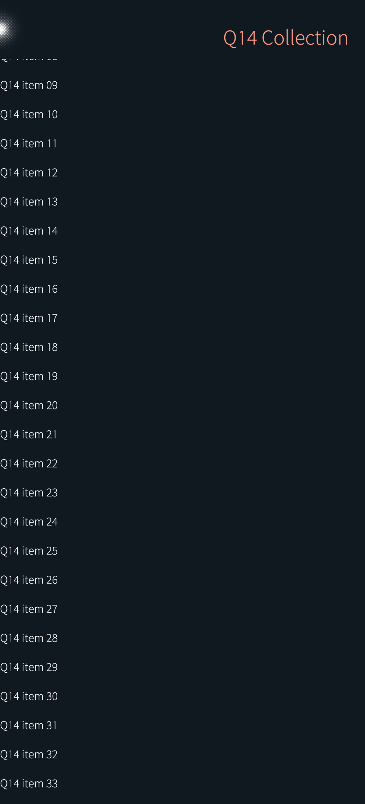
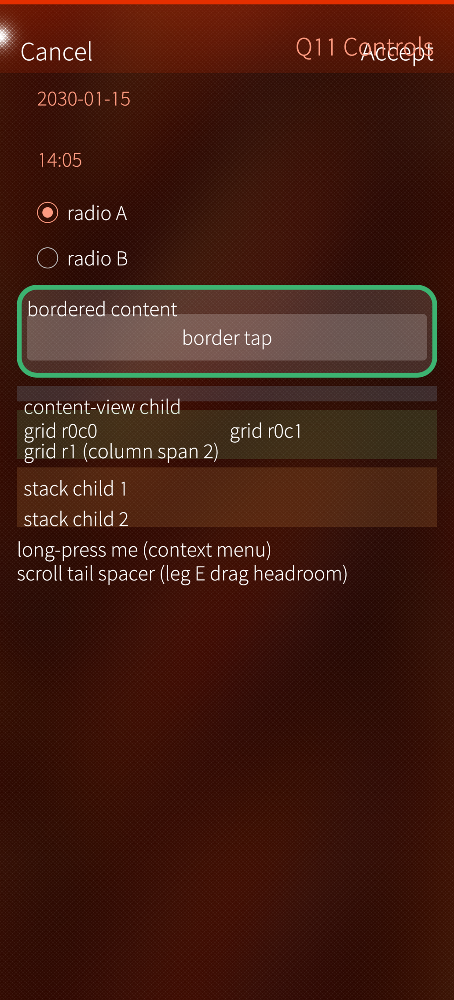
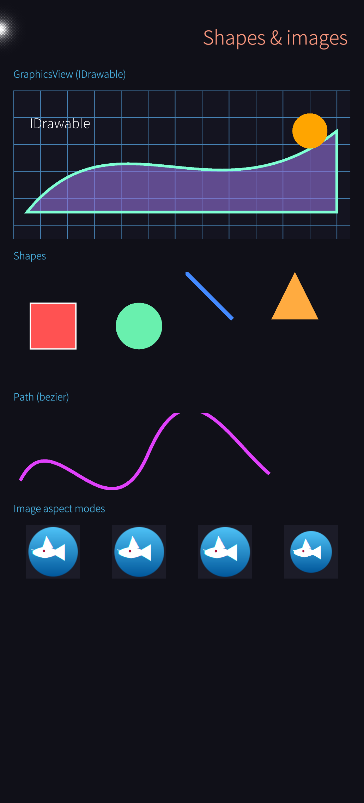
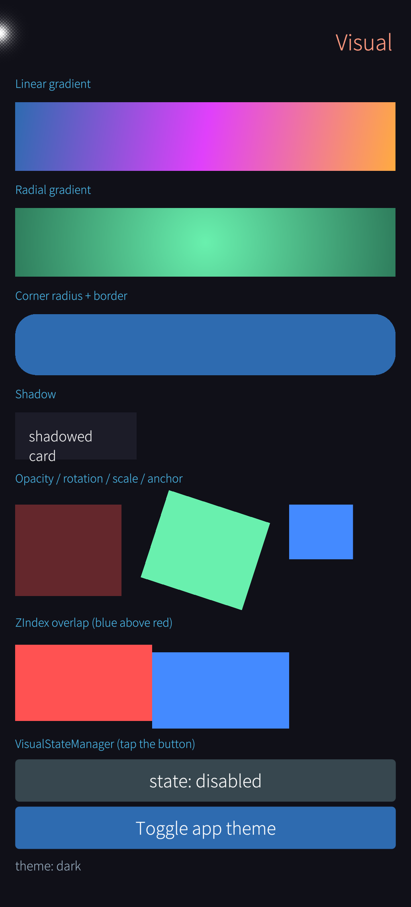

# MAUI for Sailfish OS

A .NET MAUI backend for **Sailfish OS** (Jolla phones). Your MAUI app runs as a native Sailfish app: Silica
controls, the Silica page stack, pulley menus and the app cover. It is packaged as a harbour RPM.

<table>
<tr>
<td align="center"></td>
<td align="center"></td>
</tr>
<tr>
<td align="center">Sample app: tasks, controls, features hub</td>
<td align="center">SailfishKitchen: <code>CollectionView</code> grid, detail page</td>
</tr>
</table>

Both clips are recorded on a Jolla phone (Sailfish OS 5.2) with real touch input.

## Status

- All stock MAUI controls, Shell, TabbedPage and FlyoutPage, CollectionView, WebView (Gecko) and most of MAUI
  Essentials work on the phone.
- Handler parity with the official MAUI mappers: 100% (1073/1073 keys, [docs/handler-parity.md](docs/handler-parity.md)).
- On-device acceptance matrix: 31 legs (`tools/sf matrix`, list in [docs/tools.md](docs/tools.md)); the full run on
  2026-10-04 passed all 31 (the `silica` leg after its theme check was updated). SecureStorage (`f4`) needs an
  unlocked phone.
- 15 open-source MAUI apps run on the phone, some with gaps such as empty charts ([docs/porting-existing-apps.md](docs/porting-existing-apps.md)).
- What is left: [docs/parity-plan.md](docs/parity-plan.md) (roadmap), [BUG_LIST.md](BUG_LIST.md) (open defects).

## Getting started

### Prerequisites

| Where | What |
|---|---|
| Build machine | .NET SDK 11 RC1 (`11.0.100-rc.1.26425.128`, see `global.json`) |
| Build machine | `ssh`, `python3` (RPM build) |
| Build machine, only when working on this repo | `zig` (cross-compiles the native shim; no Sailfish SDK needed) |
| Phone | Sailfish OS with developer mode and a Remote connection password (tested on SFOS 5.2, aarch64; armv7hl builds but has never run on a device) |

On the phone: **Settings › Developer tools**, turn on **Developer mode** and set a password under **Remote
connection**. The phone has to be on the same network as the build machine, or connected over USB
(`192.168.2.15`).

### Packages

The packages are not on nuget.org yet. Build them from a clone into a local feed:

```bash
git clone <this repo> && cd maui-sailfish
./tools/sf pack-local     # → ~/.local/share/maui-sailfish/feed, registered as NuGet source "maui-sailfish-local"
```

If you got a feed from someone else, add it with `dotnet nuget add source <feed> --name maui-sailfish`.

### New app

```bash
# once per machine: teach the SDK the net11.0-sailfish target framework
dnx Microsoft.Maui.SailfishOS.Workload install

# a MAUI app with a Sailfish OS head next to Android/iOS/Mac Catalyst/Windows
dotnet new install Microsoft.Maui.Platforms.SailfishOS.Templates
dotnet new maui-sailfish -n MyApp && cd MyApp     # --sailfish-only: just the Sailfish head

# build the RPM, install it on the phone and start it
dotnet build -f net11.0-sailfish -t:SailfishRun
```

The first `SailfishRun` asks for the phone's address, user and the Remote connection password, installs your
SSH key and saves the settings in `~/.config/maui-sailfish/connect.info`. Details and error messages:
[docs/connecting-your-phone.md](docs/connecting-your-phone.md).

`dotnet publish -f net11.0-sailfish` alone builds the RPM (`bin/SailfishRpm/harbour-<app>-<version>.aarch64.rpm`).

### VS Code

The [MAUI Sailfish Tools](https://github.com/Pastajello-Organization/sailfishos_maui_tools) extension adds a
device picker; **F5** deploys and attaches the debugger, and **Ctrl+F5** runs without it. See
[docs/tools.md](docs/tools.md#vs-code).

## Porting an existing app

An existing MAUI app gets the Sailfish head the same way it has Android or iOS heads.

1. Install the workload once (see [New app](#new-app)).
2. Add the target framework to the `.csproj`:

   ```xml
   <TargetFrameworks>$(TargetFrameworks);net11.0-sailfish</TargetFrameworks>
   ```

3. Optional: `dotnet new maui-sailfish-platform` adds `Platforms/SailfishOS/` (the counterpart of
   `MainActivity` / `AppDelegate`, with Sailfish lifecycle events).
4. Run it: `dotnet build -f net11.0-sailfish -t:SailfishRun`.

Apps on .NET 10 need a MAUI 11 pin for the Sailfish head. Apps on .NET 8/9 need a few more csproj lines. Then
check the shared code for `#if ANDROID || IOS`, `OnPlatform` without `Default`, and Android/iOS-only plugins.

- [docs/add-sailfish-to-existing-app.md](docs/add-sailfish-to-existing-app.md): the steps, csproj blocks for
  net8/9/10, and a checklist for the shared code.
- [docs/porting-existing-apps.md](docs/porting-existing-apps.md): what broke in 17 real apps and how each was fixed.

<table>
<tr>
<td align="center"><br>MoneyFox</td>
<td align="center"><br>Profitocracy</td>
<td align="center"><br>WeatherTwentyOne</td>
<td align="center"><br>BugSweeper</td>
<td align="center"><br>Calculator</td>
</tr>
</table>

## Working on this repo

```bash
dotnet build Linux.Sailfish.slnx -c Release
./tools/sf setup                       # once: phone address, user, password
./tools/sf deploy --run --screenshot   # sample app: RPM → phone → launch → screenshot
./tools/sf matrix                      # on-device acceptance matrix (~20 min)
dotnet test tests/Linux.SailfishOS.Tests   # host unit tests
```

`tools/sf help` lists all commands. Commands, environment switches, diagnostics and screen recording:
[docs/tools.md](docs/tools.md).

## How it works

Sailfish OS has no native widget API; its UI toolkit, Silica, is QML on Qt 5.6. So the backend drives QML
instead of widgets:

```
MAUI handlers (layout, bindings, gestures, navigation)
        │  batched property + geometry ops
        ▼
libsailfishhost.so (C++ shim, Qt 5.6) → Silica QML adapters
        ▼
Qt Quick → Wayland → lipstick compositor
```

MAUI does all layout. Native elements are created once and updated in place. Lists stay virtualized in a Silica
`ListView`. More in [docs/architecture.md](docs/architecture.md).

## Documentation

| Using it | |
|---|---|
| [add-sailfish-to-existing-app.md](docs/add-sailfish-to-existing-app.md) | adding the Sailfish head to a MAUI app; `Platforms/SailfishOS` and lifecycle hooks |
| [porting-existing-apps.md](docs/porting-existing-apps.md) | what broke in real apps and how it was fixed |
| [connecting-your-phone.md](docs/connecting-your-phone.md) | phone setup, connection settings, error messages |
| [tools.md](docs/tools.md) | `tools/sf` commands, VS Code, environment switches, screen recording |
| [sailfishos-packaging.md](docs/sailfishos-packaging.md) | RPM/harbour packaging, permissions, cover, store notes |
| [sailfish-apis.md](docs/sailfish-apis.md) | Sailfish-only APIs (remorse, bottom sheet, notifications, cover, lifecycle) with clips |
| [silica-parity.md](docs/silica-parity.md) | which native Silica features a MAUI app gets, and the test for each |
| [custom-controls.md](docs/custom-controls.md) | handlers for custom and library controls, own QML adapters |
| [native-interop.md](docs/native-interop.md) | reaching native Sailfish: P/Invoke, D-Bus, QML modules, own C++/Qt |

| Internals and status | |
|---|---|
| [architecture.md](docs/architecture.md) | design rules and the Sailfish/Qt 5.6 facts they rest on |
| [handler-parity.md](docs/handler-parity.md) | generated mapper-key parity against the official MAUI handlers |
| [aot-and-trimming.md](docs/aot-and-trimming.md) | payload options (trimming, ReadyToRun, NativeAOT) and measurements |
| [profiling.md](docs/profiling.md) | EventPipe, QML profiler and memory on the phone |
| [parity-plan.md](docs/parity-plan.md) | roadmap |
| [BUG_LIST.md](BUG_LIST.md) | open defects |
| [app-test-campaign.md](docs/app-test-campaign.md) | log of the real-app test campaign |
| [skiasharp-plan.md](docs/skiasharp-plan.md) | SkiaSharp support plan |

## Repository layout

```
src/Linux.SailfishOS/                 the backend (Microsoft.Maui.SailfishOS package)
  Handlers/                           Sailfish handlers: controls, pages, Shell/Tabbed/Flyout
  Native/                             C++ shim (libsailfishhost.so)
  Platform/QtHost/                    renderer, navigation, bridges; qml/ = Silica adapters
  buildTransitive/                    MSBuild targets: publish, RPM, SailfishRun/SailfishSetup
src/Linux.SailfishOS.Diagnostics/     on-device acceptance legs (tools/sf matrix)
src/Linux.SailfishOS.SkiaSharp/       SkiaSharp views for Sailfish
src/Linux.SailfishOS.Workload*/       the net11.0-sailfish workload manifest and its installer tool
samples/Linux.SailfishOS.Sample/      demo app: tasks, control galleries, diagnostics legs
samples/SailfishKitchen/              recipe browser, same XAML on Sailfish and iOS
templates/                            dotnet new maui-sailfish / maui-sailfish-platform
tests/                                host unit tests, public-API guard
tools/                                tools/sf: build, deploy, run, test, record on the phone
docs/                                 guides, architecture, screenshots, clips
```

<details>
<summary>Sample app screenshots</summary>

<table>
<tr>
<td><br/>Task list</td>
<td><br/>Statistics: Silica ProgressBar, Slider, Switch, Entry</td>
</tr>
<tr>
<td><br/>CollectionView on a Silica ListView</td>
<td><br/>Controls gallery</td>
</tr>
<tr>
<td><br/>Shapes and images</td>
<td><br/>Transforms, opacity, visual states</td>
</tr>
</table>

</details>

## License

[MIT](LICENSE)
