# Porting existing MAUI apps: what breaks and how to fix it

[add-sailfish-to-existing-app.md](add-sailfish-to-existing-app.md) covers the steps. This page collects what
happened when real open-source apps got a `net11.0-sailfish` head on a Jolla phone (Sailfish OS 5.2, aarch64):
the build and startup errors, what the app had to change, and what does not work yet.

| App | Stack | App changes | Result |
|---|---|---|---|
| dotnet/maui-samples `10.0/Apps`: Calculator, Weather, TipCalc, RpnCalculator, SolitaireEncryption, GameOfLife | net10, plain MAUI | the TFM and the MAUI 11 pin only | run |
| WhatToEat, EmployeeDirectory, BugSweeper, WordPuzzle, WeatherTwentyOne (maui-samples) | net10, plain MAUI | a few lines each | run |
| DeveloperBalance (maui-samples) | net10, Syncfusion Toolkit | the TFM and the MAUI 11 pin only | runs; Syncfusion text inputs draw no outline, the chart is empty |
| MoneyFox | net8, MSAL, Sharpnado tabs, LiveCharts, CommunityToolkit | csproj, MSAL in `SailfishApplication`, a tab effect | runs; charts empty |
| Profitocracy | net9, Shell, LiveCharts, Plugin.LocalNotification, CommunityToolkit 12 | csproj, notifications skipped, `OnPlatform` defaults | runs; charts empty, no notifications |
| WeightTracker | net8, UraniumUI Material, Microcharts, AiForms.SettingsView, CommunityToolkit 7 | csproj, one picker reset | onboarding and home run; chart, settings page and the add-weight popup do not |
| GameSpur | net10, Firebase, private API config | csproj, stand-ins for three Android/iOS-only libraries, 13 converters | builds; needs the authors' private configuration to start |
| GitTrends | net9, C# Markup, central package management, Shiny, Sentry, Syncfusion Charts | csproj, Shiny and StoreReview stand-ins | starts, then stops at the first page: CommunityToolkit.Maui.Markup typed bindings do not work on MAUI 11 rc1 (see below) |

Every change is listed with its code in [What each port changed](#what-each-port-changed).

The first screen of each app on the phone (2026-10-02). Each app was installed from the port's RPM, started by
`tools/sf run`, and shot after it settled. Profitocracy shows Serbian, the language left from a language-switch
test. Its progress bars glow because they are Silica's glass bars. DeveloperBalance's empty "Task Categories" box
is the Syncfusion chart, which does not draw yet. GitTrends and GameSpur are not shown: neither gets past startup.

<table>
<tr>
<td align="center">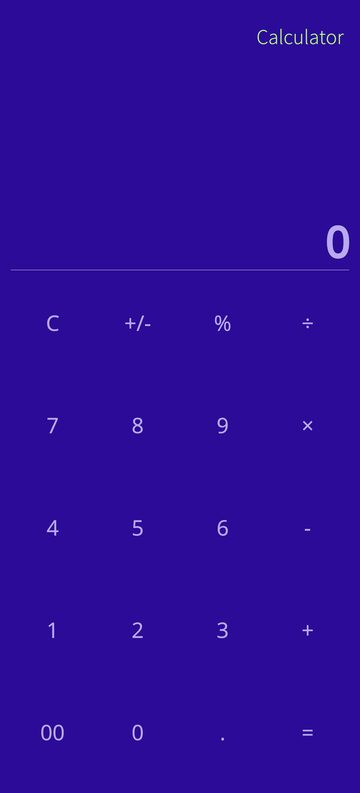<br>Calculator</td>
<td align="center">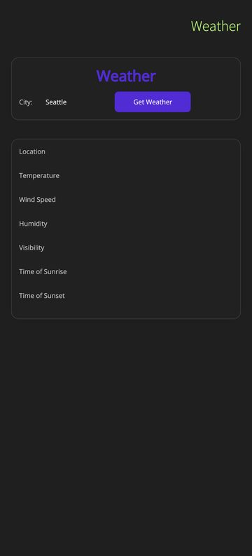<br>Weather</td>
<td align="center">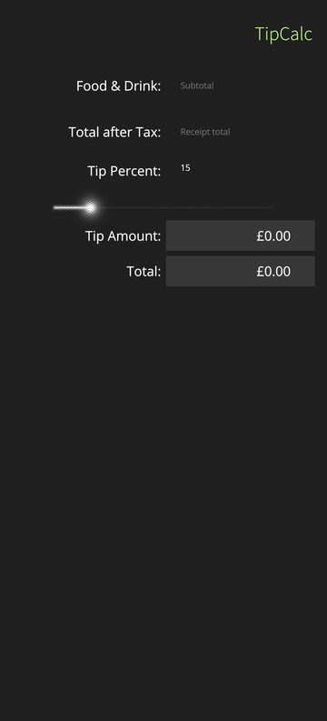<br>TipCalc</td>
<td align="center">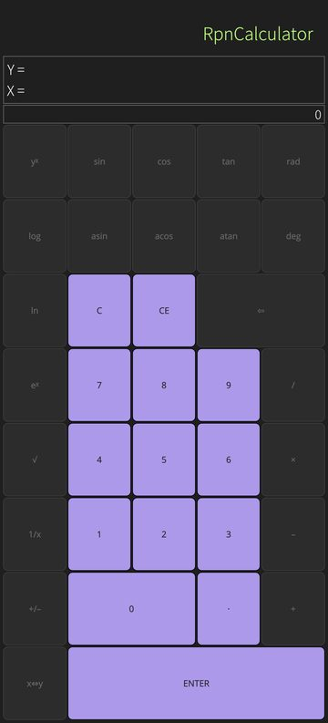<br>RpnCalculator</td>
<td align="center">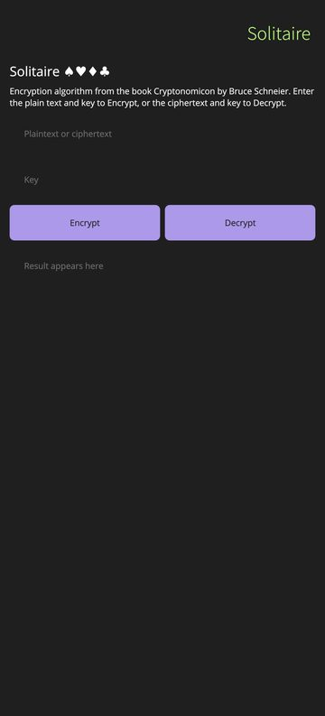<br>SolitaireEncryption</td>
</tr>
<tr>
<td align="center">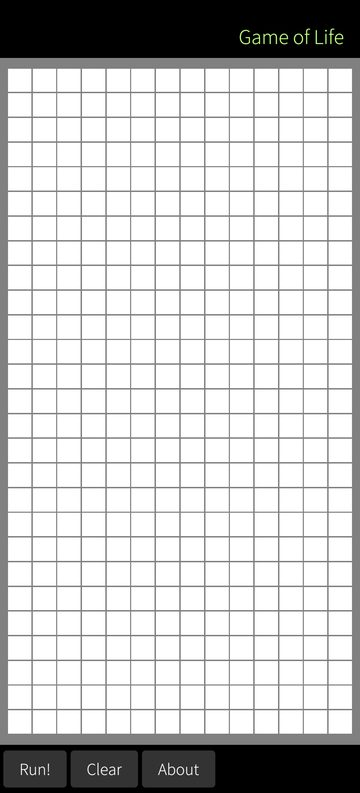<br>GameOfLife</td>
<td align="center">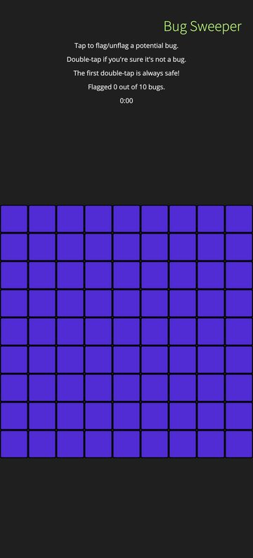<br>BugSweeper</td>
<td align="center">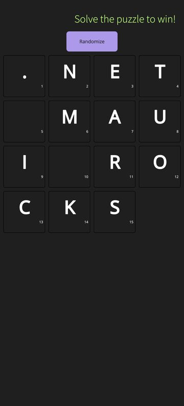<br>WordPuzzle</td>
<td align="center">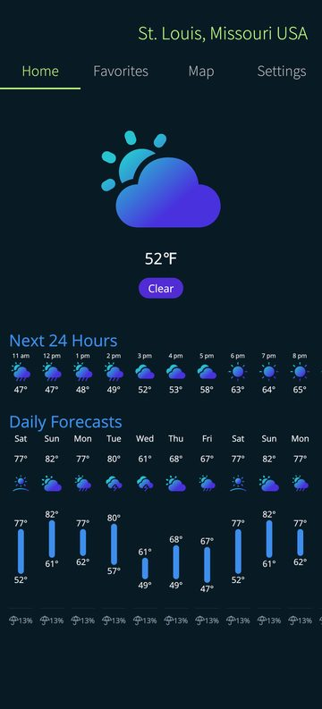<br>WeatherTwentyOne</td>
<td align="center">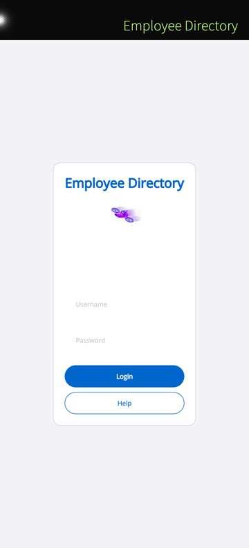<br>EmployeeDirectory</td>
</tr>
<tr>
<td align="center">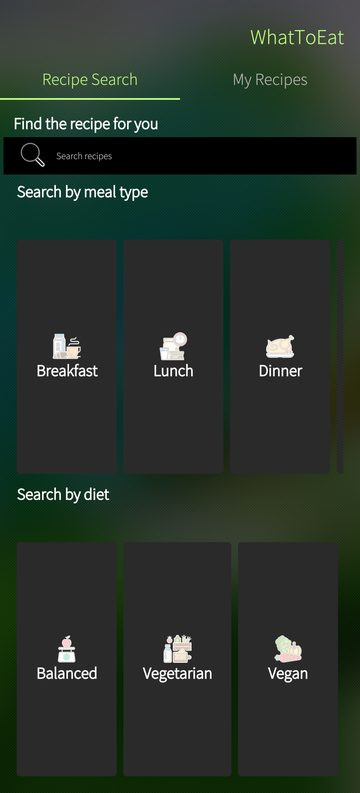<br>WhatToEat</td>
<td align="center">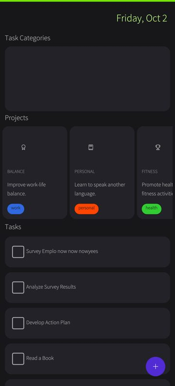<br>DeveloperBalance</td>
<td align="center">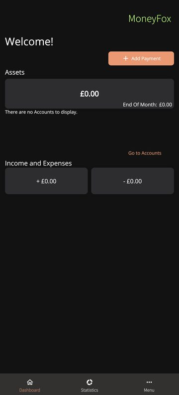<br>MoneyFox</td>
<td align="center">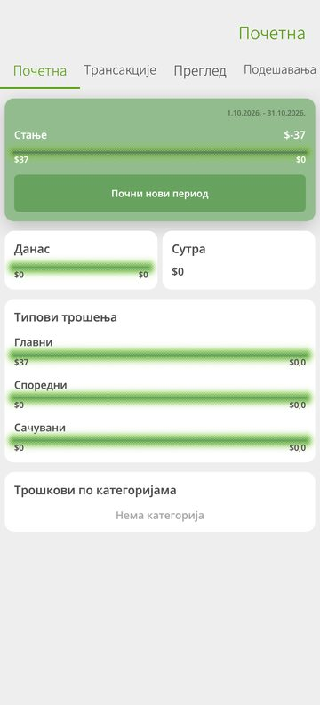<br>Profitocracy</td>
<td align="center">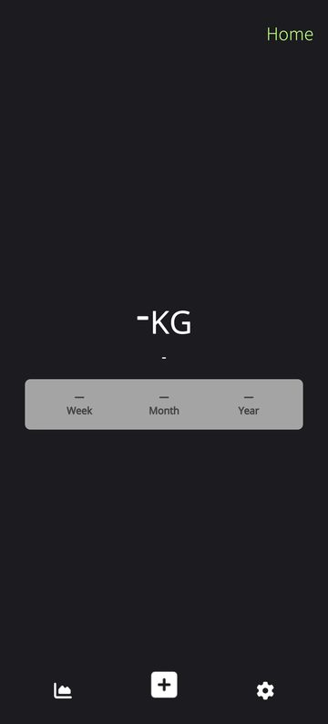<br>WeightTracker</td>
</tr>
</table>

## Build and restore

**The SDK.** The Sailfish head needs the .NET 11 SDK, so `global.json` must select it:

```json
{ "sdk": { "version": "11.0.100-rc.1.26425.128", "rollForward": "latestFeature" } }
```

**Out-of-support mobile heads (NETSDK1202).** SDK 11 refuses the net8 and net9 Android/iOS workloads. Gate them
with a property instead of overriding `TargetFrameworks` on the command line: a global `-p:TargetFrameworks=…`
also reaches project references and breaks them (NETSDK1005).

```xml
<!-- SailfishOnly=true builds the Sailfish head alone -->
<TargetFrameworks Condition="'$(SailfishOnly)' != 'true'">net8.0-android;net8.0-ios</TargetFrameworks>
<TargetFrameworks>$(TargetFrameworks);net11.0-sailfish</TargetFrameworks>
```

```bash
dotnet build App.csproj -f net11.0-sailfish -p:SailfishOnly=true -t:SailfishRun
```

With `tools/sf`, pass it to the inner publish too: `SF_PUBLISH_PROPS="-p:SailfishOnly=true"`.

**MAUI 11 for the Sailfish head only.** Pin `MauiVersion` and update the app's own `Microsoft.Maui.Controls`
reference in a Sailfish-only group. Leave the other heads alone:

```xml
<PropertyGroup Condition="$([MSBuild]::GetTargetPlatformIdentifier('$(TargetFramework)')) == 'sailfish'">
	<MauiVersion>11.0.0-rc.1.26451.6</MauiVersion>
</PropertyGroup>
<ItemGroup Condition="$([MSBuild]::GetTargetPlatformIdentifier('$(TargetFramework)')) == 'sailfish'">
	<PackageReference Update="Microsoft.Maui.Controls" Version="$(MauiVersion)" />
</ItemGroup>
```

**Central package management** (`Directory.Packages.props`) rejects a `Version` on a `PackageReference` (NU1008):
override with `VersionOverride` instead. With transitive pinning, MAUI packages that only a class library
references (`Microsoft.Maui.Essentials`) stay pinned to the central 9.x version and restore fails with NU1109.
Give them an override in the Sailfish group as well:

```xml
<ItemGroup Condition="$([MSBuild]::GetTargetPlatformIdentifier('$(TargetFramework)')) == 'sailfish'">
	<PackageReference Update="Microsoft.Maui.Controls" VersionOverride="$(MauiVersion)" />
	<PackageReference Include="Microsoft.Maui.Essentials" VersionOverride="$(MauiVersion)" />
</ItemGroup>
```

**Warnings as errors.** MAUI 10/11 marks `DisplayAlert`, `FadeTo`, `TranslateTo`, `SetUseSafeArea`, … obsolete
(CS0618). A repo that lists CS0618 in `WarningsAsErrors` fails on the Sailfish head only. `WarningsNotAsErrors` does
not override an explicit list, so use `<NoWarn>$(NoWarn);CS0618</NoWarn>` in the Sailfish property group. A NuGet
audit run as errors (`NuGetAuditMode=all`) also fails on advisories published after the app's last release, on
every head. `<NuGetAuditSuppress Include="<advisory URL>" />` names the one to accept.

`Microsoft.Maui.Controls.Compatibility` has no MAUI 11 counterpart. Condition it out of the Sailfish head
(`… != 'sailfish'`).

**Libraries that cap the MAUI version (NU1107).** CommunityToolkit.Maui 12.1 requires MAUI `[9.0.80, 10.0.0)`. A
later release of the same major has an open bound and the same API (12.3.0). Use `PackageReference Update` in
the Sailfish group, as for MAUI itself. CommunityToolkit 7.x–9.x, with lower bounds only, restore as they are.

**Libraries with platform targets only (NU1202).** Microcharts.Maui 1.x ships Android/iOS/Mac/Windows assets and
nothing for plain `net`. Its 2.0 release adds `net10.0`, which the Sailfish head can use (2.0.0.3, with SkiaSharp
3.119.4). Without such a release, condition the package out and supply the types the XAML names. The XAML
compiler keeps `OnPlatform` branches for Sailfish, so every type in the file must exist.

**SkiaSharp.** SkiaSharp 3.x views (`SKCanvasView`, `SKGLView`, the `SK*ImageSource` types) work through
`Microsoft.Maui.SailfishOS.SkiaSharp`. It holds the Sailfish handlers, the counterpart of the per-platform assets
SkiaSharp ships for Android and iOS, and registers itself, so `UseSkiaSharp()` stays as it is. Restore brings no
`libSkiaSharp.so` for linux-arm64, so add the glibc build in the version the app resolves. Without it, any code
that touches SkiaSharp (even an `SKTypeface` in a view-model constructor: MoneyFox, Profitocracy) throws
`DllNotFoundException`:

```xml
<ItemGroup Condition="$([MSBuild]::GetTargetPlatformIdentifier('$(TargetFramework)')) == 'sailfish'">
  <PackageReference Include="Microsoft.Maui.Platforms.SailfishOS.SkiaSharp" Version="0.1.0" />
  <PackageReference Include="SkiaSharp.NativeAssets.Linux" Version="3.119.4" />  <!-- = the app's SkiaSharp -->
</ItemGroup>
```

Canvases behave as on Android: the same `Info`/`RawInfo` sizes, `IgnorePixelScaling`, one paint per frame however
often `InvalidateSurface` is called, and touch with `Handled` and parent-scroll interception. Limits:
- `SKGLView` draws through the same raster path, so `GRContext` is null.
- SkiaSharp 2.88 (the MAUI 6–8 line) is not supported.
- Libraries built on SkiaSharp draw, but their own platform code is theirs to port. LiveCharts' plain-`net` input
  is a stub, so its charts show but do not react to touch.

Release builds are trimmed (`TrimMode=partial`, as on Android) with Android's runtime feature switches: reflection-based
`System.Text.Json` (`GetFromJsonAsync<T>` without a `JsonSerializerContext`) and `[DefaultValue]` work as there. The
full table, and the few switches kept different for on-phone tracing and debugging, is in
[aot-and-trimming.md §2.5](aot-and-trimming.md).

## Platform `#if` blocks

Shared code often enables a feature per platform (`#if ANDROID || IOS || MACCATALYST`). The Sailfish head defines
`SAILFISH`; add it where the feature works here too. BugSweeper's double-tap recognizer was compiled for the mobile
platforms only, so tiles never revealed until `|| SAILFISH` joined the condition.

## Startup

**"Bait and switch" plugins.** The portable assembly of Plugin.StoreReview (and plugins built the same way)
throws `NotImplementedException` from `CrossStoreReview.Current`. Register a Sailfish implementation of the
interface under `#if SAILFISH`, e.g. one that does nothing for store reviews.

**Libraries whose plain-`net` asset registers stubs.** `ConfigureSyncfusionCore()` registers handlers that are
plain classes in Syncfusion.Maui.Core's `net9.0` asset. MAUI rejects them (`Unable to add handler mapping for …`),
and the app's whole handler collection fails to build. Skip the call on Sailfish; the Syncfusion views then
render empty.

**Platform-only service registrations.** Apps register Shiny's notification and job managers only under
`#if ANDROID || IOS`, but resolve services that depend on them on every head. Register Sailfish implementations
for those interfaces. Notifications can post through `SailfishNotifications.Show`.

**Plugins whose platform singleton is null on plain `net`.** `UseLocalNotification()` registers
`LocalNotificationCenter.Current`, which is null without a platform implementation, and the app dies with
`ArgumentNullException (implementationInstance)`. Skip the registration on Sailfish and treat the missing service
as unsupported:

```csharp
#if !SAILFISH
	.UseLocalNotification()
#endif
```

**Platform services from `Platforms/<os>`.** Apps that register services in `MainApplication`/`AppDelegate`
(MoneyFox's MSAL client) need the same in `Platforms/SailfishOS/SailfishApplication.cs`:
`dotnet new maui-sailfish-platform`. Match the other heads' call when `MauiProgram.CreateMauiApp` takes
arguments (GitTrends: `CreateMauiApp(AppInfo.Current)`; Essentials such as `AppInfo`, `Preferences` and `FileSystem`
are available before it runs). The generated files follow the default code style: a repo that enforces IDE0040
"accessibility modifiers unnecessary" in the build wants `static void Main` without `private`. Code that reads `MauiApplication.Current.Services` or
`MauiUIApplicationDelegate.Current.Services` can read `IPlatformApplication.Current.Services` on every head.

**`{OnPlatform}` without `Default`.** `DeviceInfo.Platform` is `SailfishOS`, which the markup extension has no
named argument for. `{OnPlatform iOS=Ionicons, Android=Ionicons.ttf#}` therefore yields null on Sailfish, and the
FontImageSource glyph renders in the wrong font. Add `Default=…`. The element form can name the platform:
`<On Platform="SailfishOS" Value="…" />`.

**Effects.** Routing effects whose platform effect lives in each platform folder (Sharpnado's tab touch effects,
XamEffects) need a Sailfish `PlatformEffect` registered with `ConfigureEffects`. Without one, the effect does
nothing; for Sharpnado tabs that means taps never switch tabs.

## What maui-sailfish does with foreign handlers

A library without a Sailfish build restores its plain-`net` assets. Its handlers then derive from MAUI's
plain-`net` handlers, whose `CreatePlatformView` throws `NotImplementedException`. maui-sailfish catches the
failure once per handler type, logs `[QT_HOST][WARN] <handler> failed for <view> — …`, and continues:

- **A handler built on a stock one falls back to the Sailfish handler of that control.** UraniumUI registers
  `StatefulButtonHandler : ButtonHandler` for every `Button`, and Plainer (under UraniumUI Material) does the same
  for its Entry and Picker views. They render and work as plain Silica controls, without the library's
  platform tweaks: `… — falling back to SailfishButtonHandler`.
- **A view that draws itself (`IDrawable`) renders its drawing** under its MAUI children: Syncfusion Toolkit's
  `SfView` controls (`… — rendered from its own drawing (IDrawable) with its children`). The drawing is recorded
  again on every render pass, not on the library's own invalidate, so animations show their end state. A drawing
  that throws (Syncfusion's text measurer on plain .NET) logs `IDrawable.Draw (…) failed` once and draws what it
  got to.
- **Anything else renders as an empty container** whose MAUI children still paint: AiForms.SettingsView, and
  SkiaSharp's views without `Microsoft.Maui.SailfishOS.SkiaSharp` (see above).
- Collection item views are the `CollectionView`'s logical children, so `{RelativeSource AncestorType=…}`
  bindings in item templates (a page model's command) resolve as on Android.

## Platform behaviour that differs from Android/iOS

These follow Silica conventions. Port authors should expect them; none needs app changes.

- `ToolbarItems` become the page's pull-down menu, in the order MAUI's toolbar gives them on the other platforms:
  sorted by `Priority` (lower first), with a Shell's own `ToolbarItems` on each of its pages. The line at the top of
  the page is its indicator. Pulley entries
  are text only: an icon-only item shows its `AutomationId`, its `SemanticProperties.Description` or its icon file's
  name (`ic_add.png` → "ic_add"); with none of them the entry is blank and the log warns once. Give such items a
  `Text` or an `AutomationId` for Sailfish.
- A `ContextFlyout` opens Silica's press-and-hold `ContextMenu`. It has no submenus: a `MenuFlyoutSubItem` shows as a
  label row followed by its own items, and `MenuFlyoutSeparator` is left out.
- A `TapGestureRecognizer` or `LongPressGestureRecognizer` on a native control (`Button`, `Entry`, `Switch`, `Slider`,
  `CheckBox`, …) fires beside the control's own action, as on Android. One on an ancestor of the control does not:
  the control took the touch. `LongPressing` reports `Completed` or `Canceled` (early release, moving beyond
  `AllowableMovement`, a pan or a second finger), as MAUI's Android backend does.
- Control events follow Android: `Button`/`ImageButton` `Pressed` and `Released` (before `Clicked`), `Slider`
  `DragStarted`/`DragCompleted`, `SwipeView` `SwipeStarted` at the start of a finger drag and `SwipeChanging` while
  it moves, and `Editor.Completed` when the editor loses focus (Return is a newline). Return on an `Entry` with
  `ReturnType.Next` focuses the next visible, editable text input on the page. A `Keyboard.Create(...)` without a
  Capitalize flag does not capitalize the first letter.
- `view.CaptureAsync()` and `window.CaptureAsync()` (MAUI 11) work: a view is cut out of a grab of the app window at
  its place on screen, so anything drawn over it is in the picture too. Screenshots are PNG or JPEG
  (`OpenReadAsync(ScreenshotFormat.Jpeg, quality)`) and are kept in memory, not left in the cache folder.
  `Clipboard.ClipboardContentChanged` also fires when another app copies text; `DeviceDisplay` reports the screen's
  real refresh rate.
- Images: `Image.IsLoading` is true from a source change until the image shows (or fails). Changing `Source` cancels
  the old source's pending stream read. A GIF from `ImageSource.FromStream` animates. Stream images are cached as files
  that are deleted when the source is collected and at the next start. An image with no size yet, or with
  `Aspect.Center`, decodes no larger than the screen's long side, so a 4000 px photo no longer decodes at full size; an
  unsized image larger than that measures at the capped size.
- An exception from app code on the UI thread (an event handler, an `async void` continuation, a timer) ends the
  app, as on Android; it used to be logged while the app went on. `SailfishExceptions.Unhandled` can mark it handled
  ([sailfish-apis.md](sailfish-apis.md#unhandled-exceptions)).
- `ContentPage.HideSoftInputOnTapped` works: a press outside a text field unfocuses the focused one, which closes the
  keyboard. (`HideSoftInputAsync`/`ShowSoftInputAsync` still throw on the plain `net` build MAUI ships for this
  head.)
- A focused text field stays above the keyboard, in portrait and landscape. Inside a `ScrollView` (or a list) the page
  gets shorter and the container scrolls to the field, like Android's `adjustResize`. In plain page content the page
  keeps its layout and slides up until the field is in view, then back when the keyboard closes, like `adjustPan`.
  A field that lies below the screen before the keyboard opens needs a `ScrollView`, as on every platform.
- Shell and TabbedPage tabs are a row under the page header. Long titles shrink before they fade. A horizontal
  swipe across the page drags it with the finger, the next tab's title beside it; released past the threshold it
  slides on to that tab, otherwise back.
- Tabs are text only: a tab's `IconImageSource` is not drawn. A tab without a `Title` shows its NavigationPage root's
  title, its explicit route, or its page type name. With more than four tabs the row scrolls sideways (about three
  and a half in view) and keeps the selected tab in view; a drag on the row scrolls it instead of switching the tab.
- MAUI 11 badges (`TabbedPage.BadgeText`/`BadgeColor`/`BadgeTextColor`, `BaseShellItem.BadgeText` on Shell tabs)
  draw as a pill on the tab title's top-right corner; an empty `BadgeText` is a dot, as on Android. Without
  `BadgeColor` the pill takes the ambience highlight colour. `ToolbarItem.BadgeText` is not drawn (pull-down menu
  entries have no badge).
- A page without a `Title` shows the app's name (`ApplicationTitle`) in its header.
- `Shell.BackButtonBehavior` `IsVisible`/`IsEnabled` false and `NavigationPage.HasBackButton` false turn off the
  back gesture and indicator. A first-run modal page cannot be swiped away.
- Hardware Back (and Escape on a keyboard) goes through `IWindow.BackButtonClicked`, as on Android: a page's
  `OnBackButtonPressed`, Shell's `BackButtonBehavior.Command`, the NavigationPage/Shell/TabbedPage/FlyoutPage pops and
  the default modal pop decide. Silica pops on the back swipe and the Back key before MAUI is asked, so a page whose
  type overrides `OnBackButtonPressed`, or that has a `BackButtonBehavior.Command`, gets no Silica back gesture or
  indicator: Back reaches it only through MAUI and its veto holds. Such a page needs its own way back (a button, or
  `OnBackButtonPressed` returning false once it allows leaving).
- A `Picker` opens Silica's inline menu. With more than five items, or inside a container that would clip the
  menu (an outlined field's rounded `Border`), it opens Silica's selection page instead.
- An `Entry`/`Editor` with a set `BackgroundColor` or `Background` has no Silica underline, as a set background
  replaces the native one on Android. The "borderless entry" idiom (`BackgroundColor="Transparent"` inside the
  app's own frame) needs no platform mapper.
- `view.ShowSoftInputAsync()`, `HideSoftInputAsync()` and `IsSoftInputShowing()` throw on this target framework (MAUI
  builds them for the platform heads only); use `SailfishKeyboard.Show(view)`, `Hide()` and `IsShowing`.
- A root page's `Loaded` (the page the app hands to its `Window`) fires before the page has a handler: MAUI's
  plain-net build raises it as soon as the page joins the window. Code there that needs the native side (focus, a
  measured size) belongs in `OnAppearing` or `HandlerChanged`. Pages pushed later get their handlers first.
- A `LinearGradientBrush` or `RadialGradientBrush` `Background` draws under any view (layouts, labels, buttons,
  controls), on the GPU; a gradient `Shadow.Brush` shadows in the average of its colours, as on iOS.
- FormattedText spans take their `BackgroundColor`, `CharacterSpacing` and `TextTransform`, and a span with a
  `TapGestureRecognizer` fires it when tapped (the sender is the `Label`). A span's own `LineHeight` is not applied;
  the label's is. Spans of different sizes or fonts are measured as one rich-text layout, so a line is as tall as
  its largest span, and a span without a `FontSize` takes the label's.
- A `GraphicsView` draws again when you call `Invalidate()`, when a property of it changes or when its size changes, as
  on Android and iOS; a drawable that changes its own state must call `Invalidate()` (it used to be redrawn on every
  update pass here). Touches arrive as `StartInteraction`, `DragInteraction` and `EndInteraction` (points in the
  view's own coordinates; a second finger sends `CancelInteraction`), and a drag on it does not swipe the page back.
  `DrawString(text, x, y, alignment)` draws with `y` on the text's baseline, as on Android; `FillPath`/`ClipPath` with
  `WindingMode.EvenOdd` leave holes, and `Antialias = false` turns antialiasing off for the whole view.
  `DrawImage` draws any `IImage` (a `SailfishImage`, or MAUI's `PlatformImage` from its bytes), and
  `SetFillPaint(new ImagePaint { Image = … })` tiles it, starting at the view's origin, one image pixel per dp. Images
  load asynchronously: the image is written to a cache file and the canvas loads it from there, so the first frame of a
  new image draws without it and the view draws again when it has loaded (Android draws it in the same frame).
  `(await Screenshot.Default.CaptureAsync()).ToImageAsync()` (`Microsoft.Maui.SailfishOS.Graphics`) turns a screenshot
  into a `SailfishImage` you can draw, resize or save.
- The legacy `ListView` works for `TextCell`, `ImageCell` and `ViewCell` rows (a `DataTemplateSelector` too):
  `ItemTapped`, `ItemSelected` and `SelectedItem` behave as elsewhere, and `SelectionMode="None"` still reports taps.
  It renders on the same native list as `CollectionView`; `SwitchCell`, `EntryCell`, context actions and `TableView`
  are not supported (one warning names the cell; a `TableView` renders nothing, with one warning). New code should use
  `CollectionView`.
- A selected `CollectionView` item looks the way its template's `VisualStateManager` `Selected` state makes it, as on
  Android and iOS; Silica draws only the press feedback. A list that relied on a default selection colour needs a
  `Selected` state (for example a `BackgroundColor` setter on the template's root). Carousel pages take the
  `CurrentItem`, `PreviousItem`, `NextItem` and `DefaultItem` states, and `IsDragging`, `IsScrolling`, `VisibleViews`
  and `IsScrollAnimated` work.
- `ItemSizingStrategy="MeasureFirstItem"` makes every row as tall as the first item and templates a row only when it
  shows, which opens a long list several times faster (500 rows: 61 ms instead of 223 ms on a Jolla phone). It applies to
  vertical lists with one `ItemTemplate`; a `DataTemplateSelector`, a horizontal list and a carousel measure every item.
- A `CollectionView` inside a `ScrollView` (or a `StackLayout`) with no height of its own is as tall as all its rows,
  and the `ScrollView` scrolls it, as on Android and iOS. Every row is then built natively, so a long list there is
  slow to open (one warning above 200 rows): give it a height, or put the content around it in its `Header`/`Footer`
  and drop the `ScrollView`.
- A vertical `CarouselView` with `Loop="True"` does not wrap (only horizontal carousels loop); it stops at its ends,
  with one warning.
- `ItemsLayout` snap points work: `SnapPointsType` `Mandatory` or `MandatorySingle` with `SnapPointsAlignment` `Start`,
  `Center` or `End`.
- `CollectionView.ItemsUpdatingScrollMode` works as elsewhere: `KeepLastItemInView` brings the end into view when
  items are added (a chat), `KeepScrollOffset` keeps the offset while the rows move under it, and the default keeps
  the visible items in place. `ScrollTo(…, animate: true)` eases there. `Scrolled` reports offsets and deltas. A Span or
  spacing set on the `ItemsLayout` object at runtime rebuilds the rows.
- A `TapGestureRecognizer` in a `CollectionView` item template fires on tap, and the tap then does not select the
  row. Pan, swipe, pointer and long-press recognizers in an item template work too; a long press does not select the
  row either, and a pan the template captured keeps the list from scrolling until the finger lifts. A `SwipeItemView` shows as a Silica swipe action: the first background colour, image and label in its
  content, with `Invoked`/`Command` as usual.
- A page's size (`Width`/`Height`, `OnSizeAllocated`) is the area below the page header and tab row, as on Android
  and iOS, so apps that size views from it fit the screen.
- `Loaded` fires when the page joins the window. Pages a Shell route push builds (`GoToAsync("detail")`) have their
  handlers by then, so `Loaded` handlers can call `SetSemanticFocus()` and similar. Any other page (a ShellContent
  template, a page the app constructs and pushes) gets its handlers on the next render; touch `Handler` there from
  `Appearing` or later.
- `SemanticScreenReader.Announce` does nothing (Sailfish OS has no screen reader), as on Android with TalkBack off.
- An exception from an `async void` handler (a command, an event) is logged as
  `[Sailfish][QT_HOST][ERROR] unhandled exception in dispatched work` with its stack, and the app keeps running.
  Android would crash; look for that line when an action silently does nothing.
- Pulling the pull-down menu all the way and releasing past its items leaves it open; tap an item then (Silica).
- `NavigationPage.HasNavigationBar="False"` (on the page, or on a TabbedPage that holds it) and
  `Shell.NavBarIsVisible="False"` (on the page, its ShellContent, section, item or the Shell; the nearest setting
  wins) hide the page header, and the content starts under the status area. The back gesture stays. A page whose own
  `BackgroundColor` is unset shows the theme behind the header even when its root layout has a colour; set the
  page's `BackgroundColor` to colour the whole screen.
- `NavigationPage.TitleView` and `Shell.TitleView` replace the header's title text with your view, laid out in the
  header's band (full width, the header's height). Views in it take taps as anywhere on the page.
- `Shell.TabBarIsVisible="False"` hides the row of the item's sections (Android's bottom tabs); a section's own
  contents (Android's top tabs) stay as a row under the header.
- `Shell.SearchHandler` shows a Silica `SearchField` under the page header (where the other platforms put the search
  box in the navigation bar): typing writes `Query` (so `OnQueryChanged` runs), the enter key confirms it (`Command`
  with `CommandParameter`, `OnQueryConfirmed`), and setting `Query` from code fills the field. `Placeholder`,
  `IsSearchEnabled` and `SearchBoxVisibility` (`Collapsible` shows the field expanded; `Hidden` removes it) follow at
  runtime; a hidden navigation bar hides the field too. Icons, colours, fonts and text alignment keep the Silica look
  (one warning lists the ones you set).
- The Shell flyout is the page's pull-down menu: one text entry per flyout item and `MenuItem`, pulled from the top.
  `FlyoutHeader`, `FlyoutFooter`, `FlyoutContent`, `ItemTemplate`, `MenuItemTemplate`, the flyout background, icon and
  size are not shown (one warning lists the ones you set). `Shell.FlyoutIsPresented = true` from code (a "menu" button)
  opens the same entries as a context menu under the page header; a pick or a tap outside closes it and sets
  `FlyoutIsPresented` back to `false`, and setting it to `false` closes the menu.
- With `ShowsResults="True"` the handler's `ItemsSource` shows as a list over the page content while it has items
  (your `ItemTemplate`, else a row with `DisplayMemberName` or the item's text). A tapped row calls `OnItemSelected`,
  sets `SelectedItem` and confirms the query, as on Android; the list then closes until the query changes. The enter
  key closes it too. The usual filtering handler works unchanged:

  ```csharp
  public sealed class FruitSearch : SearchHandler
  {
      static readonly string[] Fruit = { "apple", "apricot", "kiwi", "peach", "pear", "plum" };
      protected override void OnQueryChanged(string oldValue, string newValue) =>
          ItemsSource = string.IsNullOrEmpty(newValue) ? null : Fruit.Where(f => f.Contains(newValue)).ToList();
      protected override async void OnItemSelected(object item) =>
          await Shell.Current.GoToAsync($"fruit?name={item}");
  }
  ```
- An `Image` without a size request takes its source's size, as Android's ImageView does: a `MauiImage` its
  `BaseSize` (an SVG its own size), a bitmap packaged without `BaseSize` one dp per pixel, any other bitmap (a file, a
  stream, a download, a SkiaSharp image) its pixels ÷ density. One requested side gives the other by the aspect
  ratio. A remote image is 0 × 0 until it has loaded, then the layout grows to it.
- A view with a `PanGestureRecognizer`, `SwipeGestureRecognizer` or `PinchGestureRecognizer` keeps the drags it
  captures, as on Android and iOS: while the finger is down, Silica's back swipe and the pull-down menu leave the page
  alone. To let Silica take the drag as well (a horizontal pan that also goes back), set
  `Microsoft.Maui.Controls.PlatformConfiguration.SailfishOSSpecific.VisualElement.SetKeepsDrag(view, false)`.
- `PinchGestureRecognizer` works with two fingers (`Scale` is the change since the last update, `ScaleOrigin` the
  midpoint relative to the view, as on Android); the pinch takes over a pan in progress and the sequence is no tap.
- Drag & drop works as on Android: a press held still for half a second on a view with a `DragGestureRecognizer`
  (also inside a `CollectionView` row) starts the drag, a translucent copy of the view follows the finger, and the
  `DropGestureRecognizer` under it gets `DragOver`/`DragLeave`. Releasing over a target that accepts (`AcceptedOperation`
  not `None`) raises `Drop` (MAUI's default copies the text or image into the target), then `DropCompleted` on the
  source. Moving before the half second is a scroll or pan, not a drag. `Cancel = true` in `DragStarting` leaves the
  press to the view's other gestures. A second finger or a release elsewhere ends the drag with `DropCompleted` only.
  While dragging, the back swipe, the pull-down menu and the list under the finger hold still. The data stays inside
  the app: Sailfish has no system drag & drop between apps.
- `RotationX`/`RotationY` turn the view in 3D with Android's default perspective (camera at 1280 dp), and
  `ScaleX`≠`ScaleY` or a rotation inside a scaled layout are drawn exactly. Taps on a 3D-turned view hit its
  unturned rectangle.
- `DisplayAlertAsync`, `DisplayPromptAsync` and `DisplayActionSheetAsync` open a panel across the top of the screen,
  laid out as Sailfish's system dialogs (the permission and USB mode prompts): the title and message centred in the
  highlight colour, text buttons under them (cancel left, accept right), the page still visible, dimmed, below.
  Nothing is pushed on the page stack, and back navigation waits until the panel closes. A tap on the dimmed page
  cancels. A single-button alert shows its one button as the acknowledgement. A prompt's Enter key accepts, and the
  panel stays above the keyboard. An action sheet lists its choices as full-width rows, the destructive one first in
  the error colour.
- A dialog asked for while another is open waits and opens when the first closes, so two `DisplayAlertAsync` calls
  in a row both show and both return their answer. A dialog can be asked for from any thread. On a right-to-left page
  the panel is mirrored; `Keyboard.Email`, `Url`, `Numeric` and `Telephone` prompts open the matching keyboard. A
  navigation asked for while a dialog is open waits until it closes (the panel belongs to the page under it).
- `PushAsync(page, false)`, `PopAsync(false)`, `InsertPageBefore` and `RemovePage` change the page stack without
  Silica's slide. The four most recent pages under the top keep their native views; going back further rebuilds a
  page's native view (its MAUI state stays; native-only state such as a text caret does not).
- A Button's `TextColor` or `BackgroundColor` set back to `null` (or a VisualState setter that ends) returns to
  Silica's theme colours, as clearing a colour returns the platform's own on Android.
- `Application.OpenWindow` does nothing (a Sailfish app has one window, as an iOS app without multiple scenes) and
  logs a warning; `Application.CloseWindow` on the app's window quits the app.
- A missing image file shows nothing, as on Android, and logs
  `[Sailfish][QML_OBJECT][WARN] image source not found, nothing shown: File: …` once per file.
- An `Image` filling a `Border` with a `RoundRectangle` or `Ellipse` `StrokeShape` (round avatars) is masked to the
  shape in the colour behind the Border, with the Border's solid stroke on top. The mask is exact on a solid
  background only.
- Flicking a list against its end dims the list content for a moment: Silica's end-of-list feedback.
- A `ProgressBar` is Silica's glass bar: the filled part glows in `ProgressColor`, which stands out on a light page.
- `Flashlight` drives the system torch (the Top menu's toggle). Sailjail has no permission for it, so in a sandboxed
  app (the default) it throws `FeatureNotSupportedException`; it works with `<SailfishSandboxing>false</SailfishSandboxing>`.
- `Contacts` cannot reach the user's address book: a platform limit, not a missing feature. Sailfish OS keeps it in
  privileged data that only system apps open (the `Privileged` permission plus a `mapplauncherd` `privileges.d`
  entry, as Jolla's People app has). Sailjail's `Contacts` permission does not open it. A third-party app, sandboxed or not,
  reads qtcontacts-sqlite's non-privileged store, which does not hold the user's contacts.
  `GetAllAsync` therefore returns an empty list, and `PickContactAsync` opens Silica's contact selection page
  showing "No people" (back returns `null`). In a sandbox both need `Contacts` in `SailfishPermissions`, else
  `PermissionException`. This is not worked around: an app that needs contacts has to say it is unavailable on
  Sailfish OS.
- `Geolocation` needs `Location` in `SailfishPermissions`, else `PermissionException` (as on Android without the
  manifest entry). `Permissions.RequestAsync` never shows a dialog: Sailjail asks once, at the first launch.
- `AppActions` become the buttons of the app's home-screen cover: the first two actions (a Silica cover has two).
  Tapping one raises `AppActions.OnAppAction`. The icon is a theme cover icon name (`icon-cover-search`), an
  `image://` or a file path; without one the button shows `icon-cover-next`.
- `WebAuthenticator` opens the sign-in page in the system browser and completes when the browser hands the callback
  URL back. The callback scheme must be declared (`<SailfishUrlSchemes>myapp</SailfishUrlSchemes>`), or the call
  throws `InvalidOperationException`. That URL goes to the waiting call, not to `OnAppLinkRequestReceived`. A
  sign-in the user abandons stays pending until its cancellation token fires or a new one starts.
- `SecureStorage` keeps secrets in Sailfish Secrets when the daemon can open the app's device-lock collection. On a
  phone without Jolla's device-lock integration the daemon never gets the lock code and the collection stays locked
  (unlocking the screen does not help); the app then uses the file store (obfuscation only, the key lives next to
  the data) and logs `SecureStorage: Sailfish Secrets unavailable (… collection locked …)`. Entries move into
  Secrets once it opens.
- A borderless `Entry` (`BackgroundColor` set) without a `Placeholder` has no Silica label line, and an Entry taller
  than its natural height centres its text (MAUI's default `VerticalTextAlignment`), as on Android.
- A `Label`, `Button`, `Entry`, `Editor`, `SearchBar`, picker or `RadioButton` without a `FontSize` uses Silica's
  theme size (`Theme.fontSizeMedium`), larger than MAUI's 14 dp, so unstyled text reads like the rest of the phone.
  A `FontSize` of exactly 18 counts as unset too, because 18 is the default MAUI reports when the app sets none.
  Use 17.9 or 18.1 to pin a size near 18.
- Text follows the phone's Settings › Display › Text size, as on Android: unset sizes through Silica's theme, and an
  explicit `FontSize` (also a span's) scaled by the same factor (`Theme.fontSizeMedium / Theme.fontSizeMediumBase`)
  unless the element sets `FontAutoScalingEnabled="False"`. The factor is read once per start, so a changed setting
  applies when the app is next opened.

- Colours an app sets explicitly, such as the default MAUI template's `Styles.xaml` (white or near-black pages,
  purple buttons), apply on Sailfish too and cover the ambience wallpaper and theme. A colour left unset follows the
  ambience. To keep a style's colour for the other platforms only, as the `maui-sailfish` template does, wrap it:
  `<Setter Property="TextColor"><OnPlatform x:TypeArguments="Color"><On Platform="Android, iOS, MacCatalyst, WinUI"
  Value="{AppThemeBinding …}" /></OnPlatform></Setter>`. No branch matches on `SailfishOS`, so the property stays
  unset there.
- `HybridWebView` works on the Gecko web view: the page loads its `DefaultFile` from the `HybridRoot` folder
  (`Resources/Raw/wwwroot` by default, shipped under the app root) through a loopback address of its own
  (`http://127.0.0.1:<port>`), `_framework/hybridwebview.js` is served as on the other platforms, and
  `SendRawMessage`/`RawMessageReceived`, `InvokeJavaScriptAsync`, `EvaluateJavaScriptAsync` and JavaScript's
  `HybridWebView.InvokeDotNet` (with `SetInvokeJavaScriptTarget`) behave as on Android. A JavaScript error in
  `InvokeJavaScriptAsync` throws `SailfishHybridWebViewJavaScriptException` (MAUI's own exception type is internal on
  this target framework). Like `WebView` it needs the `WebView` Sailjail permission.
- `Microsoft.Maui.Graphics.IImage` (resize, re-encode) is QImage on the phone. `PlatformImage.FromStream`
  does not work here: on this target framework MAUI's `PlatformImage` only keeps the bytes, and its `Downsize` and
  `Resize` throw `PlatformNotSupportedException`. MAUI cannot redirect that static. Use
  `SailfishImage.FromStream`/`FromBytes` (`Microsoft.Maui.SailfishOS.Graphics`), or resolve `IImageLoadingService` from
  the app's services (it gives `SailfishImage`s). `SailfishImage.From(image)` converts a `PlatformImage` you already
  hold. `Downsize` keeps the aspect ratio and leaves a smaller image alone. `Resize`: `Fit` letterboxes with transparent
  bars, `Bleed` crops the centre, `Stretch` distorts. `Save` writes PNG, JPEG (with quality), BMP or TIFF. Qt does not
  write GIF, so a resized GIF comes out as PNG. Read formats are whatever the phone's Qt image plugins read (PNG, JPEG,
  GIF, BMP, WebP, …). EXIF orientation is applied.

## Not supported yet

- **SkiaSharp 2.88 views**, a GPU `GRContext` in `SKGLView`, and input of SkiaSharp-based libraries whose
  plain-`net` platform code is a stub (LiveCharts: charts draw, touch does nothing).
- **CommunityToolkit.Maui platform features.** The v1 `Popup` (CommunityToolkit ≤ 9, `ShowPopupAsync`) never
  opens. `Toast`, `Snackbar` and `Badge` have no Sailfish implementation; their plain-`net` services throw or do
  nothing. (CommunityToolkit 12+ shows popups as modal pages; that path is not verified yet.) No Sailfish add-on
  for the toolkit is planned: the backend covers MAUI itself. On Sailfish, show the message with
  `DisplayAlertAsync`, or as a `Label` on the page.
- **Syncfusion Toolkit text.** Syncfusion measures text with its own measurer, which exists only in its platform
  builds; on plain .NET it throws. Text inputs draw without their outline and charts stay empty
  (`IDrawable.Draw (…) failed` in the log). No add-on is planned: reaching the measurer means reflection into
  Syncfusion's internals, which would break with each Syncfusion release.
- **Native-only controls** with no cross-platform part, such as AiForms.SettingsView.
- **Plugins** with Android/iOS implementations only: local notifications, biometrics, in-app rating.
- **Essentials the platform lacks:** `TextToSpeech` (no speech engine), `Geocoding` (no geocoder) and `Passkeys` (no
  WebAuthn authenticator) throw `FeatureNotSupportedException`, as MAUI does on a device without the feature;
  `TextToSpeech.GetLocalesAsync` returns no locales. `MediaPicker.CapturePhotoAsync`/`CaptureVideoAsync` likewise.
  These stay out on purpose, as do `BlazorWebView` (`HybridWebView` covers web UI with a .NET bridge) and
  `MauiSplashScreen` (Sailfish apps have no splash screen).
- **`FileResult.OpenReadAsync()`** throws: MAUI's plain-`net` `FileBase` has no platform reader and the method is
  internal to MAUI. Read `File.OpenRead(result.FullPath)` instead. `ContentType` and `FileName` work.
- **The instance form of a permission** (`new Permissions.Camera().CheckStatusAsync()`, `RequestAsync()`,
  `ShouldShowRationale()`) throws `NotImplementedInReferenceAssemblyException`: MAUI's plain-`net` `BasePlatformPermission`
  has no hook. Use the generic static form, `Permissions.CheckStatusAsync<Permissions.Camera>()`, which reaches the
  Sailfish implementation (Sailjail permissions; a sandboxed app is Granted only for what `<SailfishPermissions>`
  declares, and `Permissions.Flashlight` is Denied in a sandbox, where no Sailjail permission reaches the torch).
- **Pickers in a sandbox** show only the folders the app declares: `MediaPicker` needs `Pictures`/`Videos` and
  `MediaIndexing`, `FilePicker` `UserDirs`/`Documents`/`Downloads` in `<SailfishPermissions>`; without them the picker
  opens empty (a warning names the missing ones).

## MAUI 10/11 changes that break older libraries everywhere

These show up on the Sailfish head first because it is the first MAUI 11 head an older app gets. They happen on
Android/iOS with the same MAUI version too.

- **UraniumUI `PickerField` loops forever** (100 % CPU, "not responding") when its `SelectedItem` is set to a value
  not in its items, e.g. resetting it to `""`: `""` and `null` alternate between the field and its inner `Picker`.
  It reproduces in a console app with no platform at all: UraniumUI 2.7.4 on MAUI 10.0.60 and 11 rc1, and 2.16
  and 3.0 on MAUI 11 rc1. On MAUI 8.0.6 it does not happen. Reset with `null` instead.
- **`Shell.Current` is null until a window exists.** Code that runs in `App`'s constructor or `CreateWindow` and
  navigates through `Shell.Current` throws.
- **TwoWay bindings call `ConvertBack` while the binding context propagates**, so converters that assume a user
  edit run at startup.
- **MAUI 11 rc1 dropped the `InternalsVisibleTo` grants for CommunityToolkit** that MAUI 10 has
  (`CommunityToolkit.Maui.Core`, `.Markup`, …). CommunityToolkit.Maui.Markup's typed bindings
  (`.Bind(Label.TextProperty, static (VM vm) => vm.Name)`) derive from MAUI's internal `TypedBindingBase` and throw
  `MethodAccessException` when a page is built, with Markup 6.0.1 and 7.0.1 alike. An app built on C# Markup
  (GitTrends) cannot open its first page on MAUI 11 rc1 until the toolkit and MAUI agree again. Bindings by path
  (`.Bind(Label.TextProperty, nameof(VM.Name))`) do not go through that type.

## What each port changed

Every port adds `net11.0-sailfish` to `TargetFrameworks` and pins `MauiVersion` 11 for that head (see
[add-sailfish-to-existing-app.md](add-sailfish-to-existing-app.md#2-add-the-target-framework)). The net8/net9 apps also
gate their mobile heads behind `SailfishOnly`, as shown there. Everything beyond that is listed below. Apps not named
needed nothing more: Calculator, Weather, TipCalc, RpnCalculator, SolitaireEncryption, GameOfLife and DeveloperBalance.

### maui-samples (net10)

- **WhatToEat:** `Microsoft.Maui.Controls.Compatibility` conditioned out (`… != 'sailfish'`).
- **EmployeeDirectory:** its class library `EmployeeDirectory.Core` (`net10.0`, MAUI 10) gets a `net11.0` target.
  Without it, the head's project reference brings MAUI 10 back (NU1605):

  ```xml
  <TargetFrameworks>net10.0;net11.0</TargetFrameworks>
  <PropertyGroup Condition="'$(TargetFramework)' == 'net11.0'">
      <MauiVersion>11.0.0-rc.1.26451.6</MauiVersion>
  </PropertyGroup>
  ```

- **BugSweeper** (`Tile.cs`): the double-tap recognizer that reveals a tile was compiled for the mobile platforms only.

  ```csharp
  #if ANDROID || IOS || MACCATALYST || SAILFISH
      TapGestureRecognizer doubleTap = new TapGestureRecognizer { NumberOfTapsRequired = 2 };
  ```

- **WordPuzzle:** two `#if ANDROID || IOS` blocks leave a variable unassigned on any other head, so the shared code
  does not compile. `GameSquare.cs` sets the font size and `MainPage.xaml.cs` the layout multiplier. Both get
  `|| SAILFISH`.
- **WeatherTwentyOne:** the `App` constructor navigates through `Shell.Current`, which MAUI 11 leaves null until a
  window exists. The service locator also had no branch for this head:

  ```csharp
  // App.xaml.cs
  if (DeviceInfo.Idiom == DeviceIdiom.Phone)
      ((Shell)MainPage).CurrentItem = PhoneTabs;     // was Shell.Current.CurrentItem

  // Services/ServiceExtensions.cs
  #elif SAILFISH
      IPlatformApplication.Current!.Services;
  ```

### Profitocracy (net9)

- csproj: the `SailfishOnly` gate, Compatibility conditioned out, and in the Sailfish item group:

  ```xml
  <PackageReference Update="Microsoft.Maui.Controls" Version="$(MauiVersion)" />
  <PackageReference Update="CommunityToolkit.Maui" Version="12.3.0" />          <!-- 12.1 caps MAUI below 10 -->
  <PackageReference Include="SkiaSharp.NativeAssets.Linux" Version="3.116.1" /> <!-- LiveCharts -->
  ```

- `MauiProgram.cs`: `UseLocalNotification()` under `#if !SAILFISH`. The plugin's `Current` is null on plain `net`.
  `NotificationService` reads it through a null-safe property and reports `NotificationResult.NotSupported`:

  ```csharp
  private static INotificationService? Center => LocalNotificationCenter.Current;

  public static async Task<bool> AreNotificationsEnabled() =>
      Center is { IsSupported: true } center && await center.AreNotificationsEnabled();
  ```

- XAML: `Default=Ionicons` added to all seven `{OnPlatform iOS=Ionicons, Android=Ionicons.ttf#}` font families.
- `Platforms/SailfishOS/` from `dotnet new maui-sailfish-platform`, unchanged.

### MoneyFox (net8)

- csproj: the gate, Compatibility conditioned out, `Microsoft.Maui.Controls` updated to `$(MauiVersion)`, and
  `SkiaSharp.NativeAssets.Linux` 2.88.6 (LiveCharts).
- `Platforms/SailfishOS/SailfishApplication.cs` registers the OneDrive backup's MSAL client, as `MainApplication`
  and `AppDelegate` do. The redirect is the desktop loopback, which the system browser returns to:

  ```csharp
  protected override MauiApp CreateMauiApp()
  {
      MauiProgram.AddPlatformServicesAction = services =>
          services.AddSingleton(PublicClientApplicationBuilder.Create(MSAL_APPLICATION_ID)
              .WithRedirectUri("http://localhost").Build());
      return MauiProgram.CreateMauiApp();
  }
  ```

- Sharpnado.Tabs taps its tabs through a routing effect whose plain-`net` asset has no platform effect, so tabs
  never switched. A Sailfish `PlatformEffect` turns the tap into a gesture recognizer:

  ```csharp
  // MauiProgram.cs
  #if SAILFISH
      .ConfigureEffects(effects => effects
          .Add<Sharpnado.Tabs.Effects.CommandsRoutingEffect, SharpnadoTapEffect>()
          .Add<Sharpnado.Tabs.Effects.TouchRoutingEffect, SharpnadoTouchEffect>())   // ripple only: empty
  #endif

  // Platforms/SailfishOS/SharpnadoTapEffect.cs
  internal sealed class SharpnadoTapEffect : PlatformEffect
  {
      private TapGestureRecognizer? _tap;

      protected override void OnAttached()
      {
          if (Element is not View view)
              return;
          _tap = new TapGestureRecognizer();
          _tap.Tapped += (_, _) =>
          {
              var command = Commands.GetTap(view);
              var parameter = Commands.GetTapParameter(view);
              if (command?.CanExecute(parameter) == true)
                  command.Execute(parameter);
          };
          view.GestureRecognizers.Add(_tap);
      }

      protected override void OnDetached()
      {
          if (Element is View view && _tap is not null)
              view.GestureRecognizers.Remove(_tap);
          _tap = null;
      }
  }
  ```

### WeightTracker (net8)

- csproj: the gate, Compatibility conditioned out, and in the Sailfish item group:

  ```xml
  <PackageReference Update="Microsoft.Maui.Controls" Version="$(MauiVersion)" />
  <PackageReference Update="Microcharts.Maui" Version="2.0.0.3" />   <!-- 1.x: platform TFMs only (NU1202) -->
  <PackageReference Update="SkiaSharp" Version="3.119.4" />
  <PackageReference Include="SkiaSharp.NativeAssets.Linux" Version="3.119.4" />
  ```

- `WelcomeModelView.cs`: `SelectedItem = null!;` instead of `""`. A UraniumUI `PickerField` loops forever on a value
  that is not in its items (see below).

### GitTrends (net9, central package management)

- csproj, Sailfish groups (`VersionOverride`, since `Directory.Packages.props` owns the versions):

  ```xml
  <NoWarn>$(NoWarn);CS0618</NoWarn>   <!-- CS0618 is in the repo's WarningsAsErrors -->

  <PackageReference Update="Microsoft.Maui.Controls" VersionOverride="$(MauiVersion)" />
  <PackageReference Include="Microsoft.Maui.Essentials" VersionOverride="$(MauiVersion)" />   <!-- NU1109 -->
  <PackageReference Update="CommunityToolkit.Maui.Markup" VersionOverride="7.0.1" />
  <PackageReference Include="SkiaSharp.NativeAssets.Linux" VersionOverride="3.119.1" />
  ```

  and, for every head, `<NuGetAuditSuppress Include="https://github.com/advisories/GHSA-2m69-gcr7-jv3q" />`.
- `MauiProgram.cs`: `ConfigureSyncfusionCore()` under `#if !SAILFISH`. The app registers Shiny's managers under
  `#if ANDROID || IOS` only, so the Sailfish head registers its own, and Plugin.StoreReview's `Current` throws:

  ```csharp
  #if SAILFISH
      builder.Services.AddSingleton<Shiny.Notifications.INotificationManager, SailfishNotificationManager>();
      builder.Services.AddSingleton<Shiny.Jobs.IJobManager, SailfishJobManager>();
  #endif
  …
  #if SAILFISH
      services.AddSingleton<IStoreReview>(new SailfishStoreReview());   // no-op: no in-app review here
  #else
      services.AddSingleton<IStoreReview>(CrossStoreReview.Current);
  #endif
  ```

  `SailfishNotificationManager` posts at once through `SailfishNotifications.Show`/`Close`, and keeps channels,
  badges and schedules in memory. `SailfishJobManager` keeps jobs and runs them only on request (the app's unit-test
  mock), since there is no background scheduler.
- `SailfishApplication.CreateMauiApp() => MauiProgram.CreateMauiApp(AppInfo.Current)`, as on the other heads.
- `Program.Main` without `private`: the repo enforces IDE0040.

### GameSpur (net10)

- csproj: `Microsoft.Maui.Controls`, `.Controls.Core`, `.Core` and `.Essentials` updated to `$(MauiVersion)` (the app
  references them explicitly). `Sharpnado.Maui.Nuke` and `Vapolia.StrokedLabel` are conditioned out: they ship
  Android/iOS/Windows assets only.
- `Platforms/SailfishOS/LibraryShims.cs` keeps the shared code and XAML compiling without them. It provides a no-op
  `UseNuke()` and `UseStrokedLabelBehavior()`, and `StrokedLabel`'s attached properties under the library's XAML
  namespace (`[assembly: XmlnsDefinition("https://vapolia.eu/Vapolia.StrokedLabel", …)]`). It also defines the
  Android-only `HtmlLabel` type, because the XAML compiler keeps every `OnPlatform` branch for this head. Images then
  load uncached, and labels draw without a stroke.
- `MauiProgram.cs`: `AddHandler<Shell, TabbarBadgeRenderer>()` under `#if ANDROID || IOS`. Two stand-ins, registered
  under `#if SAILFISH`: Firebase push (the plugin's plain-`net` asset is reference-only, and its `Current` throws) and
  CommunityToolkit's `IBadge` (its plain-`net` default throws):

  ```csharp
  #if SAILFISH
      NoPushNotification.Install(builder);   // IFirebasePushNotification + permissions: denied, no token
      NoBadge.Install();                     // IBadge.SetCount does nothing; set through Badge's internal SetDefault
  #endif
  ```

  `AppShell.OnAppearing` skips `RegisterNotificationCategories` under `#if !SAILFISH`.
- 13 converters threw `NotImplementedException` from `ConvertBack`. MAUI 11 calls it on TwoWay bindings while the
  binding context propagates, so they return `Binding.DoNothing`.
- `Services/Fetcher.cs`: the instance id is an Android id or an iOS vendor id. The Sailfish head stores a random one:

  ```csharp
  #elif SAILFISH
      Preferences.Default.Get(AppConstant.InstanceIdKey, string.Empty) is { Length: > 0 } saved
          ? saved : Guid.NewGuid().ToString("N")[..30];
      Preferences.Default.Set(AppConstant.InstanceIdKey, InstanceID);
      return InstanceID;
  ```

- `ArticlePage.xaml`: `<On Platform="iOS,SailfishOS">` reuses the iOS branch (a plain `Label`).

## Driving a port on the phone

- `MAUI_SAILFISH_TAPS` scripts input from launch, in screenshot pixels. Each entry starts with its time in ms
  after launch: `6000:x,y` taps, `6000:x,y>x2,y2` drags (swipes; `…>x2,y2@2500` takes 2.5 s and holds at the end,
  as a pulley needs), `6000:"text"` types into the focused field. Example:
  `tools/sf run --env MAUI_SAILFISH_TAPS='6000:903,227;8500:516,441;11000:900,240>300,240'`. The `dev tap #N` log
  lines need `MAUI_SAILFISH_QT_HOST_DIAG=1`. A tap in the top-left corner of a pushed page hits Silica's back
  indicator and goes back; a harmless filler tap is one on the page title.
- `SF_PKG`/`SF_BIN` point `tools/sf run`, `kill` and `screenshot` at the ported app
  (`SF_PKG=harbour-moneyfox SF_BIN=MoneyFox.Ui`). The defaults come from the current directory.
- `MAUI_SAILFISH_QT_HOST_DIAG=1` logs handler pushes, navigation and QML events. Add
  `MAUI_SAILFISH_QT_HOST_INPUT_TRACE=1` to see which element each touch hit and who consumed it, and
  `MAUI_SAILFISH_FIRST_CHANCE=N` to print the first N first-chance exceptions with their stacks. Use the last one for
  async startup code that swallows exceptions.
- `tools/sf run` stops printing the log after a short while, but the app keeps running. A late `dev tap` line
  missing from the output does not mean the app hung; take a screenshot.
