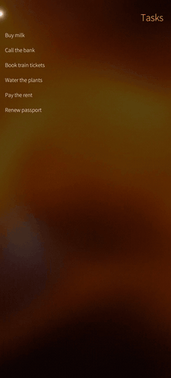
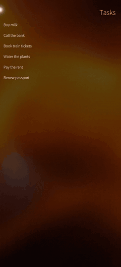
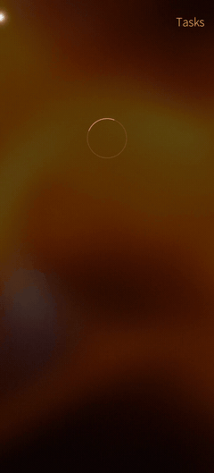
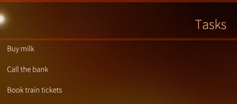
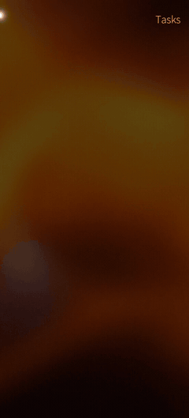

# Sailfish-native APIs

Most of a MAUI app needs nothing Sailfish-specific: controls, navigation, `ToolbarItems`, `ContextFlyout`, dialogs,
`CollectionView` and Essentials already render as their Silica counterparts
([`silica-parity.md`](silica-parity.md) lists each one and the test that checks it). This page covers what MAUI has
no API for: Silica idioms and Sailfish services an app calls directly.

All of it lives in `Microsoft.Maui.SailfishOS.Platform`. In a multi-platform project, keep the calls in
`Platforms/SailfishOS/` or behind `#if SAILFISH` (the package defines it for the `net11.0-sailfish` head).
Every call is safe from any thread; callbacks run on the main thread.

| API | Silica / Sailfish | Use it for |
|---|---|---|
| [`SailfishRemorse`](#sailfishremorse) | `RemorsePopup`, `RemorseItem` | a destructive action the user can undo during a countdown, instead of an "Are you sure?" dialog |
| [`SailfishBottomSheet`](#sailfishbottomsheet) | `DockedPanel` | a panel that slides in from a screen edge |
| [`SailfishNotifications`](#sailfishnotifications) | `Nemo.Notifications` | a system notification with a banner |
| [`SailfishCover`](#sailfishcover) | `CoverBackground`, `CoverActionList` | the app's card on the home screen |
| [Lifecycle events](#lifecycle-events) | `QGuiApplication`, Silica window, MCE | cover state, orientation, ambience, keyboard, display, lock screen, memory pressure, quit |
| [Opening URLs and files](#opening-urls-and-files) | `.desktop` `MimeType`, D-Bus `openUrl` | links and files other apps hand to yours |
| [`SailfishPage`](#sailfishpage) | `Page.allowedOrientations` | a page that turns to landscape (a video, a photo) while the rest of the app stays portrait |
| [`SailfishTheme`, `SailfishDisplay`](#theme-and-display) | ambience, window | read-only state |

Also native without extra code, shown here because they are easy to miss:
[`Page.IsBusy`](#pageisbusy) and [a text `EmptyView`](#text-emptyview).

## SailfishRemorse

The Sailfish way to confirm a destructive action: it runs after a short countdown (4 s by default), and a tap
on the bar undoes it. The task completes `true` after the action ran, `false` when the user undid it.

```csharp
// A page-wide action: a RemorsePopup at the top of the page.
bool cleared = await SailfishRemorse.ExecuteAsync("Clearing all tasks", () => Tasks.Clear());

// One element: a RemorseItem over it. Inside a CollectionView row it covers the whole row.
await SailfishRemorse.ExecuteAsync(rowView, "Deleting", () => Tasks.Remove(task));
```

Pass `null` as the text to get Silica's localized "Deleted". `SailfishRemorse.CancelAll()` undoes every pending
countdown, for example before the data they act on reloads.

<table><tr>
<td align="center"><br><sub><code>ExecuteAsync(text, …)</code></sub></td>
<td align="center"><br><sub><code>ExecuteAsync(rowView, text, …)</code></sub></td>
</tr></table>

## SailfishBottomSheet

A Silica `DockedPanel` docked to a screen edge. It follows the user's drag; `IsOpen` and `OpenChanged` report it.

```csharp
using var sheet = new SailfishBottomSheet { Text = "3 tasks due today", Dock = "bottom" };
sheet.OpenChanged += (_, open) => Debug.WriteLine($"panel open: {open}");
sheet.Show();
// …
sheet.Hide();   // Show() again later; Close()/Dispose() releases it
```

`Dock` is `"bottom"` (default), `"top"`, `"left"` or `"right"`; `Size` sets the extent (0 = Silica's default),
`Update()` pushes changed properties to an open panel.


## SailfishNotifications

A notification in the Sailfish notification area, with a banner when `preview` is true. MAUI has no notification
API of its own.

```csharp
uint id = SailfishNotifications.Show("Reminder", "Pay the rent today");
// …
SailfishNotifications.Close(id);
```

`icon` takes a theme icon name or a path.



## SailfishCover

The app's card on the home screen. It is off unless the app asks for it (or the project sets
`<SailfishCover>true</SailfishCover>`, which shows the app title).

```csharp
SailfishCover.SetContent("Tasks", "3 due today", "Next: pay the rent");   // title + up to three lines
SailfishCover.SetActions(
	new SailfishCoverAction("image://theme/icon-cover-new", () => AddTask()),
	new SailfishCoverAction("image://theme/icon-cover-refresh", () => Sync()));   // up to two

SailfishCover.ActiveChanged += (_, _) =>
{
	if (SailfishCover.IsActive)   // the app went to the home screen
		SailfishCover.SetContent("Tasks", $"{Tasks.Count} open");
};
```

For your own cover layout, set `<SailfishCoverQml>Cover.qml</SailfishCoverQml>`: the item receives
`{title, lines}` in a declared `property var mauiCoverData` ([`sailfishos-packaging.md`](sailfishos-packaging.md#cover)).

MAUI's `AppActions` map onto the same two cover actions (`AppActions.SetAsync` replaces actions set here).

## Lifecycle events

MAUI's `Window` events (`Activated`, `Deactivated`, `Resumed`, `Stopped`) fire as on the other platforms. The native
Sailfish events are lifecycle hooks, like `AddAndroid`/`AddiOS`:

```csharp
builder.ConfigureLifecycleEvents(events => events.AddSailfish(sf => sf
	.OnCoverStatusChanged((app, status) => Debug.WriteLine($"cover {status}"))
	.OnOrientationChanged((app, orientation) => Debug.WriteLine($"orientation {orientation}"))
	.OnColorSchemeChanged((app, scheme) => Debug.WriteLine($"ambience {scheme}"))
	.OnInputMethodChanged((app, visible, keyboard) => Debug.WriteLine($"keyboard {visible} {keyboard}"))
	.OnDisplayStateChanged((app, state) => Debug.WriteLine($"display {state}"))        // Off, Dim, On (MCE)
	.OnScreenLockChanged((app, locked) => Debug.WriteLine($"lock screen {locked}"))
	.OnMemoryLevelChanged((app, level) => { if (level >= SailfishMemoryLevel.Warning) ImageCache.Clear(); })
	.OnQuitting(app => SaveState())));
```

`SailfishMauiApplication` also exposes the last MCE values (`DisplayState`, `ScreenLocked`, `MemoryLevel`); a device
where MCE does not track memory reports `Unknown`.

`OnLaunched`, `OnApplicationStateChanged` and `OnCoverActionTriggered` exist too. The same events are overridable on
`SailfishMauiApplication` in `Platforms/SailfishOS/SailfishApplication.cs`; the full table with their iOS/Android
counterparts is in [`add-sailfish-to-existing-app.md`](add-sailfish-to-existing-app.md).

## Opening URLs and files

Declare what the app opens in the project; the package does the rest, as native Sailfish apps declare it:

```xml
<SailfishUrlSchemes>myapp</SailfishUrlSchemes>          <!-- myapp://… links -->
<SailfishMimeTypes>text/plain;image/png</SailfishMimeTypes> <!-- files of these types -->
```

The `.desktop` entry gets `MimeType`, `Exec … %U` and `X-Maemo-Service/Object-Path/Method`; the RPM ships a D-Bus
activation file; the app registers `openUrl(as)` on the session bus. A link opened from another app, whether yours runs
or not, arrives where MAUI delivers deep links on Android and iOS:

```csharp
protected override void OnAppLinkRequestReceived(Uri uri)   // in your App
{
	base.OnAppLinkRequestReceived(uri);
	if (uri.Scheme == "myapp")
		_ = Shell.Current.GoToAsync(uri.AbsolutePath.TrimStart('/'));
}
```

Files come as `file://` URIs. The other way round, `Launcher.OpenAsync(new OpenFileRequest(...))` opens a file in the
app registered for its type; under Sailjail that app only sees its own allowed locations (Documents, Downloads,
Pictures, …), not your app's private data.

## SailfishPage

The orientations one page may turn to, Silica's `Page.allowedOrientations`. It works inside the app-wide setting
(`<SailfishOrientation>` in the project, `Any` by default), as an Android activity's own `screenOrientation` does:

```csharp
SailfishPage.SetAllowedOrientations(playerPage, SailfishOrientations.LandscapeMask);  // landscape either way up
SailfishPage.SetAllowedOrientations(Shell.Current, SailfishOrientations.Portrait);     // every page of the Shell
```

Set it on the page or on a container around it (a `NavigationPage`, a `Shell`, a `TabbedPage`); the nearest one
wins, and `SailfishOrientations.Default` hands the page back to the app's setting. It is a bindable attached
property, so XAML works too (`xmlns:sf="clr-namespace:Microsoft.Maui.SailfishOS.Platform;assembly=Microsoft.Maui.SailfishOS"`,
`sf:SailfishPage.AllowedOrientations="Landscape"`).

## Theme and display

```csharp
AppTheme theme = SailfishTheme.Current;              // the ambience's light/dark, as Application.RequestedTheme
SailfishOrientation o = SailfishDisplay.Orientation;  // Portrait, Landscape, …
double density = SailfishDisplay.Density;            // pixels per dp
SailfishDisplay.Changed += () => Relayout();
```

Prefer `Application.RequestedTheme` and `DeviceDisplay` in shared code: they carry the same values.

## Native without extra code

### Page.IsBusy

A busy page looks the way Silica pages do: with a pull-down menu the pulley bar pulses (`PullDownMenu.busy`),
otherwise a `PageBusyIndicator` spins in the middle of the page.

```csharp
IsBusy = true;
await LoadAsync();
IsBusy = false;
```

<table><tr>
<td align="center"><br><sub>no pulley</sub></td>
<td align="center"><br><sub>with <code>ToolbarItems</code> (top of the page)</sub></td>
</tr></table>

### Text EmptyView

A `string` `EmptyView` on a vertical list is Silica's `ViewPlaceholder`, the large dimmed text native lists show
when empty. A view or a template stays your own MAUI content.

```xml
<CollectionView ItemsSource="{Binding Tasks}" EmptyView="No tasks yet" />
```



## Recording the clips again

Every clip is a scene of the diagnostics assembly (`QtHostDiagnosticsRunner.ApiDemo.cs`):

```sh
tools/sf deploy
tools/sf record remorse-popup.mp4 --env MAUI_SAILFISH_QT_HOST=1 --env MAUI_SAILFISH_QT_HOST_DIAG=1 \
  --env MAUI_SAILFISH_QT_HOST_AUTO_SHUTDOWN=1 --env MAUI_SAILFISH_QT_HOST_APIDEMO=remorse-popup
```

Scenes: `remorse-popup`, `remorse-item`, `bottom-sheet`, `notification`, `page-busy`, `pulley-busy`, `placeholder`.
The GIFs are the scene cut out of each recording, 240 px wide at 12 fps (the pulley one is the top fifth of the
screen at 300 px).
